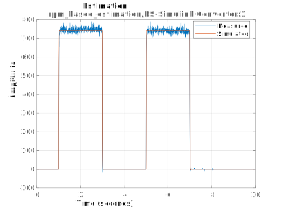
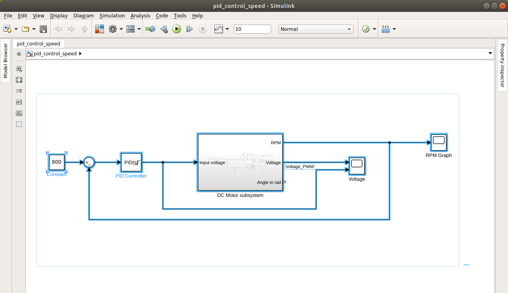
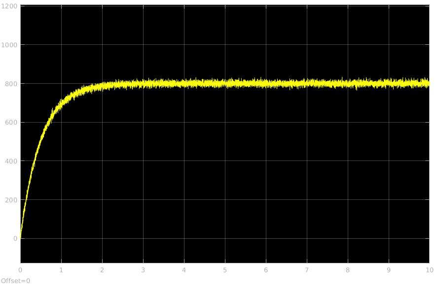

# DC Motor parameter estimation

A real experiment to estimate the parameters of a DC motor with no data sheet. The original tutorial which uses measured angle can be found here [DC Servo Motor Parameter Estimation](https://www.mathworks.com/help/sldo/examples/dc-servo-motor-parameter-estimation.html). The same method has been used to estimate the motor parameters.

The motor used is a cheap [DC 775](https://www.banggood.com/775-Gear-Motor-DC-12V-36V-3500-9000RPM-Motor-Large-Torque-High-power-Motor-p-1091058.html?cur_warehouse=CN) motor and the data acquisition(angle and RPM) has been collected using [AMT CUI 102](https://www.digikey.com/product-detail/en/cui-devices/AMT102-V/102-1307-ND/827015) encoder operating at 8092 pulses for revolution. 

ChibiOS has been used for collecting data and [bluepill](https://www.aliexpress.com/item/32786765274.html?spm=a2g0o.productlist.0.0.478e768f71fVJv&algo_pvid=b10d6084-4d40-4bf6-98b8-7667a1134afc&algo_expid=b10d6084-4d40-4bf6-98b8-7667a1134afc-0&btsid=0b0a187915860988990462496e8d8c&ws_ab_test=searchweb0_0,searchweb201602_,searchweb201603_) has been used as a Microcontroller board. The matlab scripts and simscape subsystems used for parameter estimation can be found in [Matlab](Matlab) folder.

RPM has been used to estimate the parameter of the DC motor. The interrupts caused by `AMT CUI 102` encoder are too many at about 1000 RPM, the microprocessor doesn't even get time to send the result on USB. Due to this the RPM used for estimating has been limited to below 1000RPM. Further experiment using the `Index pulse` of the encoder should be possible which can help in achieving much higher RPM.

The estimation result can be seen here

The estimated parameters are further utilized to tune a PID controller which can be seen as a system block as

and the result of the above control system which has 1 second response time is

Python script that has been used to collect data can be found in [scripts](Scripts) folder.

### Build instructions

Open VSCode and install [Cortex Debug](https://marketplace.visualstudio.com/items?itemName=marus25.cortex-debug) extension. `ctrl+shift+p` and select build to build the binary file. Debug it using the debug window of VSCode.

> Make sure that the ARM-GNU-GCC compiler is available in the path.
